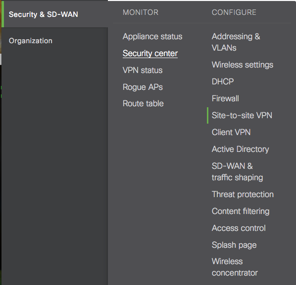
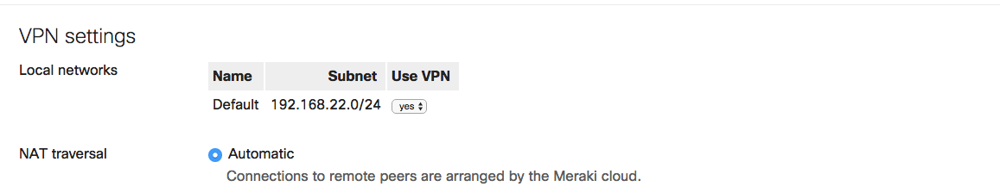
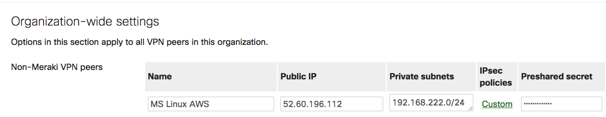
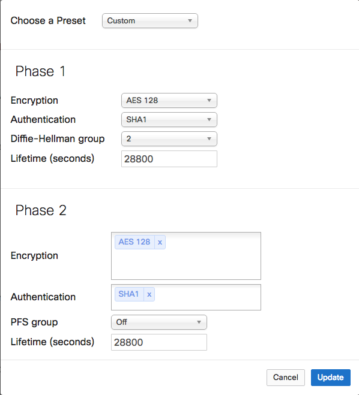

Router Configuration
--------------------

  IPSEC VPN Site-to-site endpoints need to be created on each remote store router.
  
  - You will need the public IP of the cloud POS container, local store network, and preshared key from this configuration for the cloud config install scripts.

  Meraki
--

  Checkpoint
--
  
  Netgear
--

Next
--------------------
[Admin menu Installation](install.md)

--------------------
Mike Green - mgreen@teleflora.org
