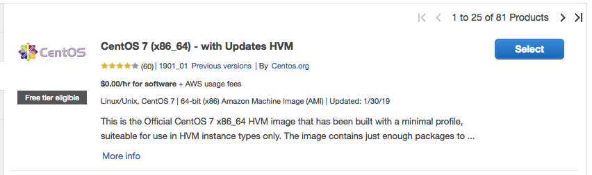
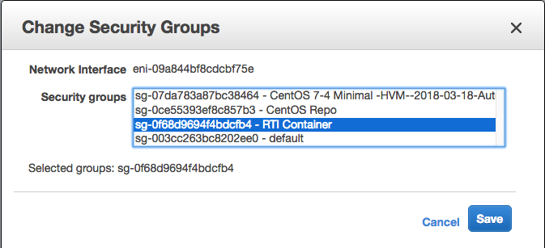
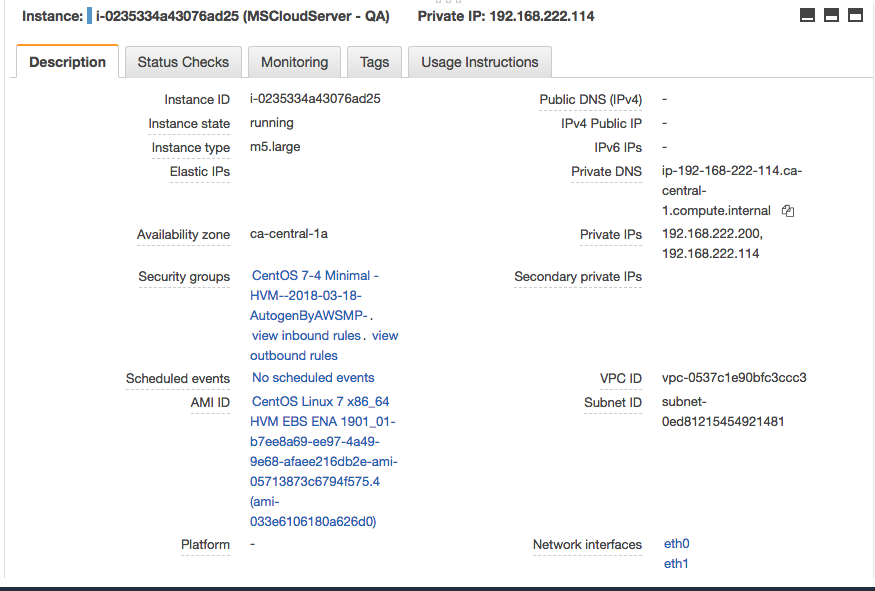

AWS EC2 Instance Creation
-------------------------
Launch a CentOS 7 EC2 instance in AWS with the following configuration options:

- A second network interface (eth1) assigned to the VM.

- 100GB of disk space.

- 2 Elastic IPs. Each assigned to each NIC. (One for the Admin menus, one for the POS container.)

	1. Leave the 1st NIC (eth0) an auto-assigned (DHCP) IP. 

	2. Assign the 2nd NIC (eth1) statically in your created network. Ex: 192.168.222.233/24

- Ports to be opened inbound to Admin menus (elastic bound to eth0): ssh (22).

- Ports to be opened inbound to POS container (elastic bound to eth1): None (Block all inbound ___initiated___ connections).

- AMI details just before launch.

-------------------

Next
----

[Remote Store Router Config](router_config.md)

-----------------
Mike Green - mgreen@teleflora.org
