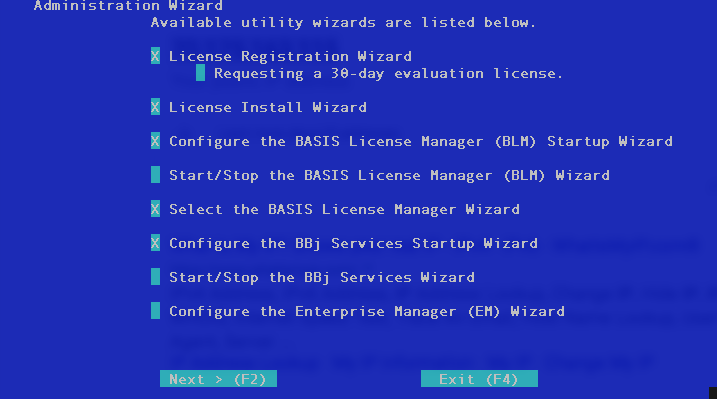
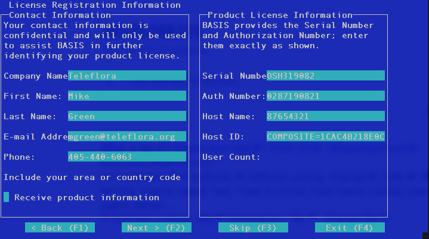
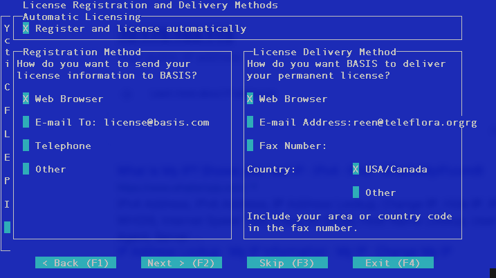
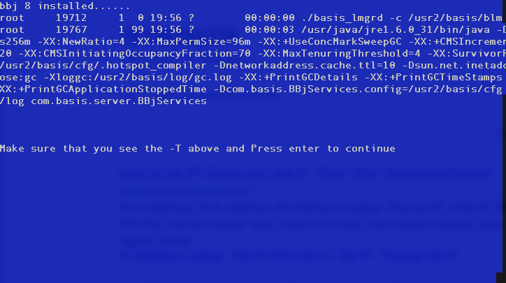

Build, Stage, and Deploy
------------------------

The process has 3 stages, each having different compliance implications:

--
Build (media creation)

An automated build process, using containers, to quickly produce OS media prepared with all the required components needed by the OS and application installation. Technically, the use of pre-prepared media from a marketplace, appstore, or other 3rd party, isn't recommended for PCI compliance. Additionally, in a catastrophic situation, quickly matching patch levels from a customer's physical server becomes a requirement.

```
 02/01/2019 12:14 AM
┏━━━━━━━━━
┃🌷 POS Cloud Menu 
┣━
┃ Mike's Store of Stuff
┃ 12345678
┃
┃ Status: 
┃ Type  : m5d.xlarge
┃ POS IP: 192.168.222.222
┃ Free  : 78G
┃ Patchd: Tue Jan 29 07:51:25 CST 2019
┃
┃ VPNs:
┃
┃ 1. POS Status
┃ 2. Start POS
┃ 3. Stop POS
┃ 4. Connect to POS
┃ 5. Restore POS Data
┃
┃ 11. List Images
┃ 12. Build OS Media
┃ 13. Stage POS
┃ 14. Delete Image(s)
┃ 15. Test Print
┃
┃ 111. VPN Status
┃ 112. Create VPN
┃ 113. Start VPN(s)
┃ 114. Stop VPN(s)
┃ 115. Delete VPN(s)
┃
┃ p. Purge All
┃ i. I/C/U Deps
┃ r. Readme
┃ x. Exit
┗━
Enter selection: 12
daisy or rti?: rti
```

```
Starting installer, one moment...
anaconda argparse: terminal size detection failed, using default width
[Errno 25] Inappropriate ioctl for device
anaconda 21.48.22.147-1 for CentOS 7 Docker 7 (pre-release) started.
Starting automated install............
Checking software selection
================================================================================
================================================================================
Installation

 1) [x] Language settings                 2) [x] Time settings
        (English (United States))                (America/Chicago timezone)
 3) [x] Installation source               4) [x] Software selection
        (http://mirrors.kernel.org/cent          (Custom software selected)
        os/7/os/x86_64/)
 5) [x] Network configuration
        (Connected: eth1, docker0 (),
        ens5)
================================================================================
================================================================================
Progress
Setting up the installation environment
.
Running pre-installation scripts
j.
Starting package installation process
Preparing transaction from installation source
Installing libgcc (1/615)
Installing fontpackages-filesystem (2/615)
Installing poppler-data (3/615)
Installing libreport-filesystem (4/615)
Installing bind-license (5/615)
Installing langtable (6/615)
.  
.. 
...
Removing intermediate container bbd1052e4a93
Step 29/31 : EXPOSE 445
 ---> Running in d7e162ea6127
 ---> 1eede00a7e58
Removing intermediate container d7e162ea6127
Step 30/31 : EXPOSE 631
 ---> Running in ca7a4630aeb5
 ---> d0ed99e5e25d
Removing intermediate container ca7a4630aeb5
Step 31/31 : CMD [“/usr/bin/bash”]
 ---> Running in b6530f49b66c
 ---> 8b1cc27630a5
Removing intermediate container b6530f49b66c
Successfully built 8b1cc27630a5
/home/tfsupport/msposapp/bin

real    14m16.460s
user    12m7.525s
sys     0m40.405s
Press enter to continue..
```

```
Enter selection: 11
REPOSITORY                         TAG                 IMAGE ID            CREATED             SIZE
centos7-rti-16.1.3                 latest              05b1c483ffcf        19 seconds ago      1.38 GB
Press enter to continue..
```

--
Staging (Install OS, and run application installation from media)

Prepare the linux boot volume, combine with added required pieces needed for deployment from managed services for the application installation, run through the installation process, then commit to the resulting container.

```
02/01/2019 12:17 AM
┏━━━━━━━━━
┃🌷 POS Cloud Menu 
┣━
┃ Mike's Store of Stuff
┃ 12345678
┃
┃ Status: 
┃ Type  : m5d.xlarge
┃ POS IP: 192.168.222.222
┃ Free  : 78G
┃ Patchd: Tue Jan 29 07:51:25 CST 2019
┃
┃ VPNs:
┃
┃ 1. POS Status
┃ 2. Start POS
┃ 3. Stop POS
┃ 4. Connect to POS
┃ 5. Restore POS Data
┃
┃ 11. List Images
┃ 12. Build OS Media
┃ 13. Stage POS
┃ 14. Delete Image(s)
┃ 15. Test Print
┃
┃ 111. VPN Status
┃ 112. Create VPN
┃ 113. Start VPN(s)
┃ 114. Stop VPN(s)
┃ 115. Delete VPN(s)
┃
┃ p. Purge All
┃ i. I/C/U Deps
┃ r. Readme
┃ x. Exit
┗━
Enter selection: 13
daisy or rti?: rti
```

```
--2018-11-15 00:43:25--  http://rtihardware.homelinux.com/ostools/ostools-1.15-latest.tar.gz
Resolving rtihardware.homelinux.com (rtihardware.homelinux.com)... 209.141.208.120
Connecting to rtihardware.homelinux.com (rtihardware.homelinux.com)|209.141.208.120|:80... connected.
HTTP request sent, awaiting response... 200 OK
Length: 367453 (359K) [application/x-gzip]
Saving to: 'ostools-1.15-latest.tar.gz'

     0K .......... .......... .......... .......... .......... 13%  394K 1s
    50K .......... .......... .......... .......... .......... 27%  726K 1s
.
..
...
Installed:
  strongswan.x86_64 0:5.7.1-1.el7    strongswan-libipsec.x86_64 0:5.7.1-1.el7   

Complete!
```
```
.
..
...
Create Primary VPN for this POS? (y/n): y
Gathering required information....
Enter LOCATION_NAME: phonehome
Enter STORE_PUBLIC: 70.175.163.115
Enter STORE_NET: 192.168.22.0
Enter PRESHAREDKEY: Telefl0ra1
ipsec VPN Connection about to be created:
--------------------
Continue y/n?
y
...
..
.
```
```
.
..
...
sos.noarch 0:3.6-11.el7.centos                                                
tzdata.noarch 0:2018i-1.el7                                                   
tzdata-java.noarch 0:2018i-1.el7                                              
...
..
.
.
..
...
 * epel: fedora-epel.mirrors.tds.net
 * extras: centos.mirror.netelligent.ca
 * updates: centos.mirror.netelligent.ca
Package httpd-2.4.6-88.el7.centos.x86_64 already installed and latest version
Nothing to do


 Set 'tfsupport' User System Password...
New password: 
...
..
.
```






```
.
..
...
[root@12345678 bin]# exit
logout
Connection to 172.17.0.2 closed.
sha256:44253f97a7faf0868157af3f7a66c6068734bbdb3731469207c446fcdb127e8a
---
centos7-rti-12345678 instance is ready!
---
OSTools Version: 1.15.0
updateos.pl: $Revision: 1.347 $
CentOS Linux release 7.6.1810 (Core) 
---

real	41m46.817s
user	0m4.282s
sys	0m6.427s
Press enter to continue..

```

```
 02/01/2019  1:16 AM
┏━━━━━━━━━
┃🌷 POS Cloud Menu 
┣━
┃ Mike's Store of Stuff
┃ 12345678
┃
┃ Status: Up 43 minutes
┃ Type  : m5d.xlarge
┃ POS IP: 192.168.222.222
┃ Free  : 69G
┃ Patchd: Tue Jan 29 07:51:25 CST 2019
┃
┃ VPNs:
┃     remote1{1}:   192.168.222.0/24 === 192.168.22.0/24
┃
┃ 1. POS Status
┃ 2. Start POS
┃ 3. Stop POS
┃ 4. Connect to POS
┃ 5. Restore POS Data
┃
┃ 11. List Images
┃ 12. Build OS Media
┃ 13. Stage POS
┃ 14. Delete Image(s)
┃ 15. Test Print
┃
┃ 111. VPN Status
┃ 112. Create VPN
┃ 113. Start VPN(s)
┃ 114. Stop VPN(s)
┃ 115. Delete VPN(s)
┃
┃ p. Purge All
┃ i. I/C/U Deps
┃ r. Readme
┃ x. Exit
┗━
Enter selection: 

```

```
Enter selection: 1
CONTAINER ID        IMAGE               COMMAND             CREATED             STATUS              PORTS                                                                                    NAMES
9e2f3ba06379        centos7-rti-16.1.3  "/usr/sbin/init"    2 minutes ago       Up 2 minutes        22/tcp, 80/tcp, 111/tcp, 443/tcp, 445/tcp, 631/tcp, 2001-2006/tcp, 9100/tcp, 15022/tcp   12345678.teleflora.com
Press enter to continue..
```

```
Enter selection: 11
REPOSITORY                         TAG                 IMAGE ID            CREATED             SIZE
12345678.teleflora.com             latest              1b69b029b807        3 minutes ago       1.58 GB
centos7-rti-16.1.3                 latest              05b1c483ffcf        7 minutes ago       1.38 GB
Press enter to continue..
```

```
Enter selection: 111
Security Associations (1 up, 0 connecting):
   phonehome[1]: ESTABLISHED 2 minutes ago, 192.168.222.233[35.182.191.52]...70.175.163.115[70.175.163.115]
   phonehome{1}:  INSTALLED, TUNNEL, reqid 1, ESP in UDP SPIs: 032b7ac6_i 0e86eb3c_o
   phonehome{1}:   192.168.222.0/24 === 192.168.22.0/24
Press enter to continue..
```

--
Deployment

Create and start VPN connection(s) if you didnt during staging, shutdown application on physical server (if exists), run final backup to sync data (if exists), restore customer data, then start the application instance in the cloud.

```
 02/01/2019  1:16 AM
┏━━━━━━━━━
┃🌷 POS Cloud Menu 
┣━
┃ Mike's Store of Stuff
┃ 12345678
┃
┃ Status: Up 43 minutes
┃ Type  : m5d.xlarge
┃ POS IP: 192.168.222.222
┃ Free  : 69G
┃ Patchd: Tue Jan 29 07:51:25 CST 2019
┃
┃ VPNs:
┃     remote1{1}:   192.168.222.0/24 === 192.168.22.0/24
┃
┃ 1. POS Status
┃ 2. Start POS
┃ 3. Stop POS
┃ 4. Connect to POS
┃ 5. Restore POS Data
┃
┃ 11. List Images
┃ 12. Build OS Media
┃ 13. Stage POS
┃ 14. Delete Image(s)
┃ 15. Test Print
┃
┃ 111. VPN Status
┃ 112. Create VPN
┃ 113. Start VPN(s)
┃ 114. Stop VPN(s)
┃ 115. Delete VPN(s)
┃
┃ p. Purge All
┃ i. I/C/U Deps
┃ r. Readme
┃ x. Exit
┗━
Enter selection: 
```

```
Enter selection: 111
Security Associations (1 up, 0 connecting):
   phonehome[1]: ESTABLISHED 2 minutes ago, 192.168.222.233[35.182.191.52]...70.175.163.115[70.175.163.115]
   phonehome{1}:  INSTALLED, TUNNEL, reqid 1, ESP in UDP SPIs: 032b7ac6_i 0e86eb3c_o
   phonehome{1}:   192.168.222.0/24 === 192.168.22.0/24
Press enter to continue..
```
-----------------------
Mike Green - mgreen@teleflora.org
